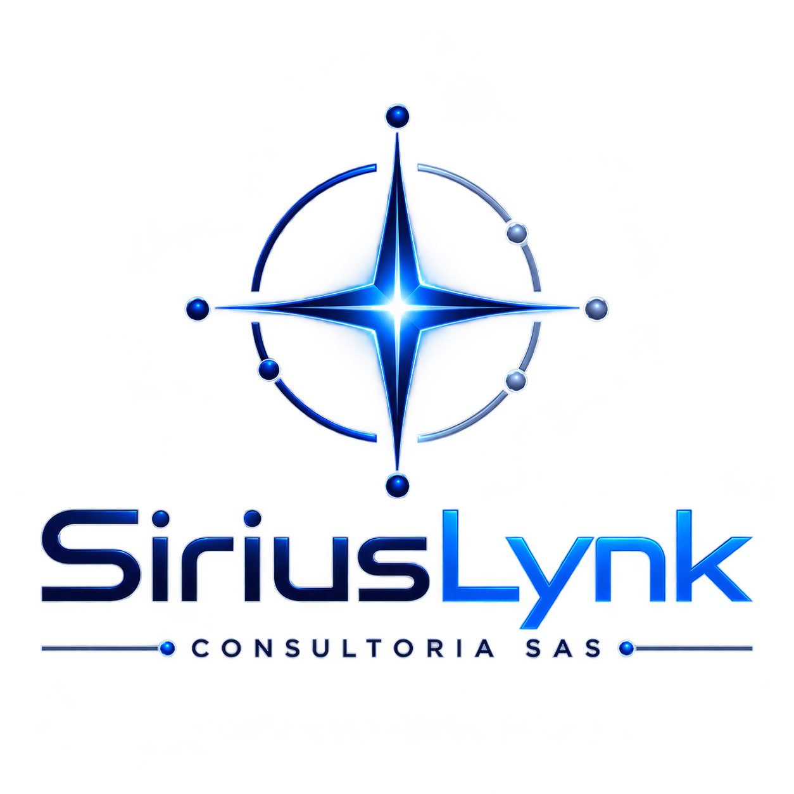

::: {.page-hero}

CONTACTO

# Conversemos sobre el problema de ingeniería.

Una primera conversación debe aclarar el objetivo, la información disponible, la decisión que debe tomar el cliente y el nivel de definición requerido.

:::

:::: {.contact-grid}
::: {.contact-card}

01

### Estudios y diseños
Recursos hídricos, hidrología, hidráulica, ambiente, energía, minería e infraestructura.
:::
::: {.contact-card}

02

### Revisión independiente
Auditoría técnica de estudios y diseños para propietarios, GAD y entidades públicas.
:::
::: {.contact-card}

03

### Ingeniería digital
BIM, CDE, trazabilidad, programación 4D, costos 5D y automatización.
:::
::: {.contact-card}

04

### Capacitación y ofertas
Formación técnica, preparación de ofertas, costos, precios unitarios y planificación de proyectos.
:::
::::

::: {.contact-panel}
::: {.contact-logo}
{fig-alt="SiriusLynk Consultoría SAS"}
:::
::: {.contact-details}
## Datos de contacto

**Completar antes de publicar**

- Correo corporativo: `[agregar]`
- Teléfono: `[agregar]`
- Ciudad / país: `[agregar]`
- LinkedIn: `[agregar]`
- Sitio definitivo: `[agregar]`
:::
:::

## Información útil para iniciar

::: {.process-rail .contact-rail}

01<strong>Proyecto</strong><small>Tipo y ubicación general</small>

02<strong>Etapa</strong><small>Prefactibilidad, diseño, revisión, construcción u operación</small>

03<strong>Decisión</strong><small>Problema técnico que debe resolverse</small>

04<strong>Información</strong><small>Datos disponibles, plazo e hitos relevantes</small>

:::

[Conocer auditoría técnica](auditoria.qmd){.btn .btn-outline-brand}
[Ver capacitaciones](capacitaciones.qmd){.btn .btn-electric}
