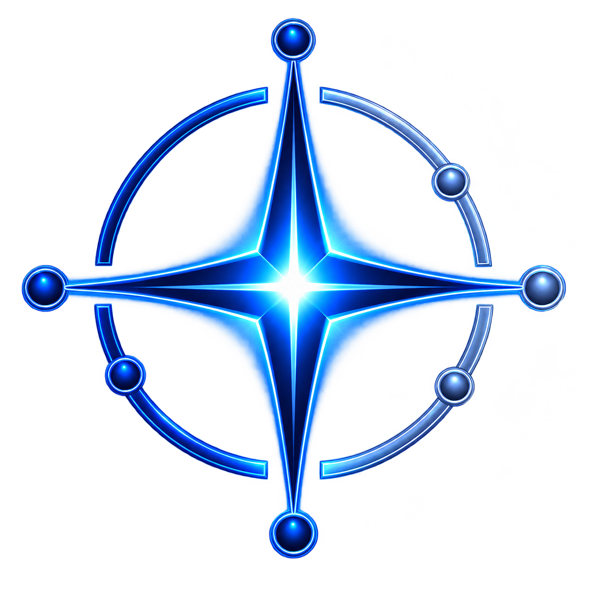

::: {.hero-sirius}
::: {.hero-overlay}
::: {.hero-content}

INGENIERÍA · AGUA · INFRAESTRUCTURA · DATOS

# Ingeniería para sistemas de agua e infraestructura.

Estudiamos, modelamos, diseñamos y revisamos proyectos integrando ingeniería especializada con gestión digital y trazabilidad de la información.

::: {.hero-actions}
[Conocer soluciones](soluciones.qmd){.btn .btn-electric .btn-lg}
[Explorar experiencia](proyectos.qmd){.btn .btn-ghost .btn-lg}
:::

Hidrología · Hidráulica · Ambiente · Auditoría técnica · BIM · CDE · Costos · Planificación · Capacitación

:::
:::
:::

::: {.brand-intro}
::: {.brand-signature}
{fig-alt="SiriusLynk Consultoría SAS"}
:::
::: {.brand-message}

SIRIUSLYNK CONSULTORÍA SAS

## Diseñar con rigor. Revisar con independencia. Gestionar con trazabilidad.

Conectamos **agua, infraestructura, datos y gestión de información** para transformar problemas complejos en decisiones de ingeniería comprensibles, verificables y útiles para el cliente.
:::
:::

:::: {.three-pillars}
::: {.pillar-card}

01

### Diseñamos
Estudios, modelación y diseños de ingeniería para recursos hídricos, infraestructura hidráulica y proyectos multidisciplinarios.
:::

::: {.pillar-card}

02

### Revisamos
Auditoría y revisión técnica independiente de estudios, modelos, diseños y entregables para propietarios y entidades públicas.
:::

::: {.pillar-card}

03

### Gestionamos
BIM, entorno común de datos, control documental y trazabilidad de decisiones para proyectos colaborativos y verificables.
:::
::::

::: {.dark-section .experience-section}

EXPERIENCIA APLICADA

## Sistemas hídricos complejos, distintos contextos de decisión

:::: {.metric-grid}
::: {.metric-card}

12

referencias hidroeléctricas

Centrales, estudios y repotenciaciones

:::

::: {.metric-card}

5

sistemas de embalse

Análisis hidrológico y soporte técnico

:::

::: {.metric-card}

4

proyectos mineros

Disponibilidad, balance y modelación hidrológica

:::

::: {.metric-card}

CDE

gestión digital

BIM, trazabilidad y colaboración con el cliente

:::
::::

[Ver el portafolio](proyectos.qmd){.btn .btn-ghost}
:::

::: {.section-heading}

SOLUCIONES

## Ingeniería organizada alrededor de las decisiones del proyecto

Las herramientas cambian según el contexto. El rigor técnico, la trazabilidad y la claridad del entregable se mantienen.

:::

:::: {.solutions-grid}
::: {.solution-card}

✦

RECURSOS HÍDRICOS

### Entender el agua antes de intervenirla
Caracterización de cuencas, climatología, disponibilidad, balances, caudales característicos, extremos y soporte a planificación.

[Explorar solución](soluciones.qmd#recursos-hidricos)
:::

::: {.solution-card}

⌁

INGENIERÍA HIDRÁULICA

### Diseñar infraestructura que responda al sistema
Modelación y diseño para captaciones, drenaje, conducción, estructuras hidráulicas, obras fluviales y sistemas asociados al agua.

[Explorar solución](soluciones.qmd#ingenieria-hidraulica)
:::

::: {.solution-card}

◎

AUDITORÍA TÉCNICA

### Revisar antes de comprometer recursos
Revisión independiente de criterios, cálculos, modelos, planos y entregables para identificar brechas y riesgos técnicos.

[Conocer auditoría](auditoria.qmd)
:::

::: {.solution-card}

◇

INGENIERÍA DIGITAL

### Hacer visible y trazable el proyecto
BIM, CDE, automatización, planificación 4D y gestión de costos 5D para conectar información, disciplinas, versiones y decisiones.

[Conocer ingeniería digital](ingenieria-digital.qmd)
:::

::: {.solution-card}

≋

AMBIENTE Y CUENCAS

### Integrar territorio, agua y gestión ambiental
Manejo de cuencas, gestión ambiental y manejo de residuos sólidos peligrosos y no peligrosos como soporte a proyectos e infraestructura.

[Ver capacidades ambientales](soluciones.qmd#ambiente-y-cuencas)
:::

::: {.solution-card}

↗

CAPACITACIÓN TÉCNICA

### Convertir experiencia aplicada en capacidades del equipo
Formación en hidráulica, hidrosanitaria, ambiente, preparación de ofertas, costos, precios unitarios, cronogramas y BIM 4D/5D.

[Ver capacitaciones](capacitaciones.qmd)
:::
::::

::: {.visual-feature}
::: {.visual-copy}

INGENIERÍA DIGITAL

## El proyecto no debería ser una colección de archivos.

Estructuramos la información para que modelos, documentos, revisiones y decisiones puedan seguirse durante el desarrollo del proyecto. El cliente accede a una visión más clara del avance y de los productos que sustentan cada decisión.

[Cómo trabajamos](ingenieria-digital.qmd){.btn .btn-electric}
:::
::: {.visual-image}
{fig-alt="Representación digital de infraestructura hidráulica en el estilo visual SiriusLynk"}
:::
:::

::: {.section-heading}

SECTORES

## Experiencia donde el comportamiento del agua condiciona decisiones críticas
:::

:::: {.sector-grid}
::: {.sector-card}

01

### Energía hidroeléctrica
Hidrología para centrales nuevas, existentes y procesos de repotenciación.
:::
::: {.sector-card}

02

### Presas y embalses
Análisis hidrológico para disponibilidad, extremos, operación y planificación.
:::
::: {.sector-card}

03

### Minería
Disponibilidad hídrica, balance, modelación, abastecimiento y soporte ambiental.
:::
::: {.sector-card}

04

### Infraestructura pública
Estudios, diseños, asistencia técnica y revisión independiente para GAD y entidades.
:::
::::

[Explorar sectores](sectores.qmd){.btn .btn-outline-brand}

::: {.dark-section .workflow-section}

SISTEMA DE TRABAJO

## Del dato a una decisión verificable

:::: {.workflow-grid}
::: {.workflow-step}
01
### Comprender
Objetivo, sistema, información disponible, restricciones y criterios de desempeño.
:::
::: {.workflow-step}
02
### Modelar
Datos, territorio, clima, hidrología, hidráulica y escenarios de diseño.
:::
::: {.workflow-step}
03
### Diseñar o revisar
Alternativas, cálculos, modelos, planos, riesgos e interfaces entre disciplinas.
:::
::: {.workflow-step}
04
### Trazar y comunicar
Versiones, observaciones, decisiones y productos dentro de un flujo digital auditable.
:::
::::
:::

::: {.section-heading}

PROYECTOS DESTACADOS

## La experiencia técnica debe poder demostrarse
:::

:::: {.featured-projects}
::: {.featured-project}

ENERGÍA · HIDROLOGÍA

### Tambo II
Caracterización hidrológica para infraestructura de captación: regionalización, curvas de duración, caudal ecológico, crecidas de diseño y sedimentos.

[Ver caso técnico](proyecto-tambo-ii.qmd)
:::

::: {.featured-project}

MINERÍA · AGUA

### Proyecto Minero Cangrejos
Evaluación climatológica multiescalar, pisos bioclimáticos, series históricas y productos WRF para disponibilidad hídrica y balance estacional.

[Ver portafolio](proyectos.qmd)
:::

::: {.featured-project}

MINERÍA · MODELACIÓN

### Proyecto Minero Cascabel
Modelación hidrológica semidistribuida de 20 unidades hidrográficas para análisis de capacidad de dilución y condiciones de fondo.

[Ver portafolio](proyectos.qmd)
:::
::::

::: {.training-band}
::: {.training-copy}

CAPACITACIÓN Y TRANSFERENCIA DE CONOCIMIENTO

## Ingeniería que también fortalece al equipo del cliente.
Programas técnicos en hidráulica e hidrosanitaria, ambiente, contratación pública, costos, planificación y BIM 4D/5D, estructurados alrededor de problemas y ejercicios aplicados.
:::
[Explorar capacitaciones](capacitaciones.qmd){.btn .btn-electric}
:::

::: {.cta-wide}
::: {.cta-mark}
{fig-alt="Isotipo SiriusLynk"}
:::
::: {.cta-copy}

SIRIUSLYNK

## Ingeniería que el cliente puede revisar durante su desarrollo, no únicamente al final.
:::
[Conversemos sobre un proyecto](contacto.qmd){.btn .btn-electric .btn-lg}
:::
